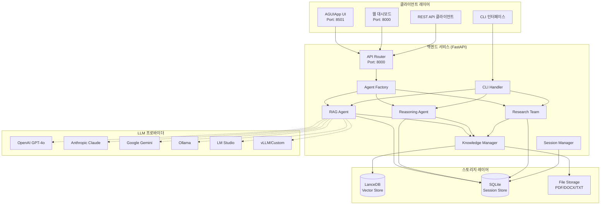

# Enterprise RAG System – Product Requirements Document (PRD)

## 1. 개요

엔터프라이즈 환경에서 대규모 문서·지식 관리와 고급 추론을 동시에 제공하는 **RAG (Retrieval‑Augmented Generation) 시스템**입니다. 다양한 형식의 문서를 빠르게 벡터화하여 하이브리드 검색과 체인‑오브‑띵킹(Chain‑of‑Thought) 기반 분석을 지원하고, 웹 UI와 REST API를 통해 손쉽게 활용할 수 있도록 설계되었습니다.

**주요 특징:**
- **다중 LLM 프로바이더 지원**: OpenAI, Anthropic (Claude), Google (Gemini), Ollama, LM Studio, vLLM 등
- **하이브리드 검색**: LanceDB 기반 벡터 검색 + BM25 키워드 검색
- **다중 에이전트 시스템**: RAG, 추론, 연구팀 에이전트 협업
- **이중 UI 제공**: AGUIApp 기반 경량 UI + 내장 웹 대시보드
- **CLI 인터페이스**: 개발자 친화적 명령줄 도구

---

## 2. 목표

1. **90% 이상의 답변 정확도** 달성 (사내 파일 기반 질문 기준)
2. **실시간 스트리밍 응답** (p95 < 2s) 제공
3. **10만 문서** 규모까지 무중단 스케일‑업
4. 일반 사용자가 **5분 내 온보딩**—문서 업로드 후 즉시 질문 가능
5. **다양한 LLM 프로바이더** 유연한 선택 및 전환 가능
6. **개발자 경험 최적화** - CLI와 웹 인터페이스 동시 제공

---

## 3. 주요 기능

| #    | 카테고리       | 기능               | 상세                                         | 구현 상태 |
| ---- | ---------- | ---------------- | ------------------------------------------ | ------- |
| 3.1  | **메모리**    | 세션 관리            | SQLite + ORM, 응답 10개 유지                    | ✅ 완료   |
| 3.2  |            | 컨텍스트 보존          | Session ID 기반 히스토리 주입                      | ✅ 완료   |
| 3.3  |            | 세션 CRUD API     | 세션 생성/조회/삭제/목록 API                        | ✅ 완료   |
| 3.4  | **RAG**    | 문서 업로드           | PDF · DOCX · TXT 다중 업로드 지원                 | ✅ 완료   |
| 3.5  |            | URL 크롤링          | URL 입력 → 자동 스크레이핑 & 벡터화                    | ✅ 완료   |
| 3.6  |            | 하이브리드 검색         | LanceDB (SearchType.hybrid) + BM25 보강      | ✅ 완료   |
| 3.7  |            | 파일 검증 및 제한       | 파일 크기/타입 검증, 10MB 제한                      | ✅ 완료   |
| 3.8  | **추론**     | 기본 RAG 에이전트      | 다중 LLM + KnowledgeTools                    | ✅ 완료   |
| 3.9  |            | 고급 추론 에이전트       | ReasoningTools · ThinkingTools 통합 (CoT 활성) | ✅ 완료   |
| 3.10 |            | Research Team    | rag\_agent ↔ reasoning\_agent 협업 모드        | ✅ 완료   |
| 3.11 |            | 추론 단계 추적         | 상세한 추론 과정 로깅 및 반환                         | ✅ 완료   |
| 3.12 | **UI**     | AGUIApp 기반 경량 UI | 실시간 대화, 세션 관리, 문서 업로드                     | ✅ 완료   |
| 3.13 |            | 내장 웹 대시보드        | 모던 반응형 웹 인터페이스 (포트 8000)                  | ✅ 완료   |
| 3.14 |            | CLI 인터페이스        | 개발자용 대화형 명령줄 도구                           | ✅ 완료   |
| 3.15 |            | 백엔드 연동           | FastAPI 백엔드와 HTTP 통신                       | ✅ 완료   |
| 3.16 | **API**    | REST 엔드포인트       | FastAPI + OpenAPI 3.1 자동 문서화               | ✅ 완료   |
| 3.17 |            | 다중 LLM 지원        | 6개 프로바이더 동적 선택 (환경변수 기반)                  | ✅ 완료   |
| 3.18 |            | 향상된 에러 처리        | 상세한 예외 처리 및 사용자 친화적 메시지                   | ✅ 완료   |
| 3.19 |            | 지식베이스 통계 API    | 문서 수, 벡터 DB 상태 조회                         | ✅ 완료   |
| 3.20 | **엔터프라이즈** | 헬스체크             | /health 엔드포인트                              | ✅ 완료   |
| 3.21 |            | 환경 검증            | 패키지/환경변수 사전 체크                            | ✅ 완료   |
| 3.22 |            | 로깅 시스템           | 구조화된 로깅 및 디버깅 지원                          | ✅ 완료   |
| 3.23 |            | 파일 정리            | 자동 임시 파일 정리 기능                            | ✅ 완료   |
| 3.24 |            | 컨테이너화            | Docker + Docker Compose                    | ✅ 완료   |
| 3.25 |            | Kubernetes 배포    | K8s 매니페스트, 리소스 관리, 헬스체크                   | ✅ 완료   |

---

## 4. 아키텍처 개요



---

## 5. 기술 스택

| 레이어         | 기술                      | 버전/상세                     | 선택 이유                        |
| ----------- | ----------------------- | ------------------------- | ---------------------------- |
| **언어**      | Python                  | 3.11+                     | ML 생태계 풍부, FastAPI 호환       |
| **웹 프레임워크** | FastAPI                 | 0.115+                    | 타입 힌트, ASGI, 자동 문서화         |
| **UI 프레임워크** | AGUIApp + 내장 웹 대시보드     | agno 패키지 + HTML/CSS/JS    | 이중 인터페이스로 다양한 사용자 지원       |
| **CLI 도구**   | 커스텀 CLI 클래스            | Python argparse 기반        | 개발자 친화적 명령줄 인터페이스          |
| **벡터 DB**   | LanceDB                 | 0.23+                     | 온‑프레미스 가능, 하이브리드 검색 지원      |
| **세션 DB**   | SQLite                  | 내장                        | 경량, 파일 기반, ORM 지원           |
| **LLM API** | **다중 프로바이더**           |                           |                              |
|             | ├─ OpenAI               | GPT-4o                    | 높은 성능, 낮은 Latency            |
|             | ├─ Anthropic            | Claude-3-Opus             | 긴 컨텍스트, 추론 능력               |
|             | ├─ Google               | Gemini-1.5-Pro-Latest   | 멀티모달, 코드 생성                 |
|             | ├─ Ollama               | Llama3, Mistral, CodeLlama | 로컬 실행, 비용 절감                |
|             | ├─ LM Studio            | 사용자 선택 모델              | 완전 온‑프레미스          |
|             | └─ vLLM/Custom          | 사용자 정의                    | 유연한 배포 옵션                   |
| **문서 처리**   | pypdf, python-docx      | Latest                    | 다양한 문서 형식 지원               |
| **웹 크롤링**   | BeautifulSoup4          | Latest                    | URL 콘텐츠 추출                  |
| **로깅**      | Python logging         | 내장                        | 구조화된 로깅 및 디버깅             |
| **검증**      | Pydantic                | 2.11+                     | 데이터 검증 및 타입 안전성           |
| **컨테이너**    | Docker                  | Latest                    | 일관된 배포 환경                   |
| **오케스트레이션** | Kubernetes              | 1.25+                     | 프로덕션 스케일링                   |
| **IaC**     | Terraform               | Latest                    | 인프라 코드화                     |

---

## 6. 프로젝트 구조 (현재 구현)

```text
enterprise-rag-system/
├── backend/                  # FastAPI 백엔드 (RAG 핵심)
│   ├── app/
│   │   ├── __init__.py
│   │   ├── main.py           # ASGI 진입점 + 웹 대시보드
│   │   ├── cli.py            # CLI 인터페이스 클래스
│   │   ├── api/
│   │   │   ├── __init__.py
│   │   │   └── router.py     # 확장된 API 엔드포인트
│   │   ├── agents/
│   │   │   ├── __init__.py
│   │   │   └── factory.py    # 다중 LLM 에이전트 팩토리
│   │   ├── core/
│   │   │   ├── __init__.py
│   │   │   ├── config.py     # 6개 LLM 프로바이더 설정
│   │   │   └── dependencies.py # FastAPI 의존성 주입
│   │   ├── knowledge/
│   │   │   ├── __init__.py
│   │   │   └── manager.py    # 향상된 문서 처리 (로깅, 검증)
│   │   └── schemas/
│   │       ├── __init__.py
│   │       ├── document.py   # 문서 스키마
│   │       ├── query.py      # 쿼리 스키마
│   │       └── session.py    # 세션 스키마 (CRUD 지원)
│   ├── requirements.txt      # 확장된 백엔드 의존성
│   └── Dockerfile           # 백엔드 컨테이너
│
├── ui/                       # AGUIApp 기반 UI
│   ├── __init__.py
│   ├── main.py              # AGUIApp 진입점 + 백엔드 연동
│   ├── config.py            # UI 환경 변수
│   ├── requirements.txt     # UI 의존성
│   └── Dockerfile          # UI 컨테이너
│
├── infrastructure/          # 배포 인프라
│   ├── docker-compose.yml  # 로컬 통합 실행
│   ├── k8s/
│   │   ├── deployment.yaml # K8s 배포 매니페스트
│   │   └── service.yaml    # K8s 서비스 설정
│   └── terraform/
│       ├── main.tf         # AWS 인프라 정의
│       └── variables.tf    # Terraform 변수
│
├── tests/                   # pytest 기반 테스트
│   ├── backend/
│   │   ├── __init__.py
│   │   └── test_main.py    # 백엔드 단위 테스트
│   ├── ui/
│   │   ├── __init__.py
│   │   └── test_ui.py      # UI 테스트
│   └── requirements.txt    # 테스트 의존성
│
├── docs/                    # 문서
│   ├── architecture.md     # 아키텍처 문서
│   └── prd.md             # 본 PRD 문서
│
├── .github/                # CI/CD 워크플로
│   └── workflows/
│       ├── ci-backend.yml  # 백엔드 CI
│       ├── ci-ui.yml       # UI CI
│       └── cd.yml          # 배포 CD
│
├── config.env.example      # 환경 설정 예시
├── run_backend.py          # 향상된 백엔드 실행 스크립트
├── run_ui.py              # UI 실행 스크립트
├── init-cursor.sh         # 개발 환경 초기화
├── .gitignore
├── LICENSE
└── README.md
```

---

## 7. LLM 프로바이더 지원

### 7.1 지원되는 프로바이더

| 프로바이더      | 모델 예시                    | 용도                  | 설정 방법              |
| ---------- | ------------------------ | ------------------- | ------------------ |
| **OpenAI** | GPT-4o, GPT-3.5-turbo   | 범용, 높은 성능          | API 키 + 모델명         |
| **Anthropic** | Claude-3-Opus, Claude-3-Sonnet | 긴 컨텍스트, 추론        | API 키 + 모델명         |
| **Google** | Gemini-1.5-Pro-Latest   | 멀티모달, 코드 생성        | API 키 + 모델명         |
| **Ollama** | Llama3, Mistral, CodeLlama | 로컬 실행, 비용 절감       | 로컬 URL + 모델명       |
| **LM Studio** | 사용자 선택 모델              | 완전 온‑프레미스          | 로컬 URL (포트 1234)   |
| **vLLM/Custom** | 사용자 정의                 | 유연한 배포 옵션          | 커스텀 URL + 모델명 + 키 |

### 7.2 동적 프로바이더 선택

```bash
# 환경 변수로 프로바이더 선택
export MODEL_PROVIDER=anthropic
export ANTHROPIC_API_KEY=sk-ant-...
export ANTHROPIC_MODEL_NAME=claude-3-opus-20240229

# 또는 OpenAI
export MODEL_PROVIDER=openai
export OPENAI_API_KEY=sk-...
export OPENAI_MODEL_NAME=gpt-4o
```

---

## 8. 사용자 인터페이스

### 8.1 웹 대시보드 (내장)
- **접속**: `http://localhost:8000/`
- **특징**: 
  - 모던 반응형 디자인
  - 실시간 문서 업로드
  - URL 콘텐츠 추가
  - 고급 추론 모드 토글
  - 세션 관리
- **대상**: 일반 사용자, 비개발자

### 8.2 AGUIApp UI
- **접속**: `http://localhost:8501/`
- **특징**:
  - 경량 대화형 인터페이스
  - 백엔드 API 연동
  - 세션 기반 대화
- **대상**: 빠른 프로토타이핑, 간단한 사용

### 8.3 CLI 인터페이스
- **실행**: `python run_backend.py --cli`
- **특징**:
  - 대화형 명령줄 도구
  - 개발자 친화적 명령어
  - 실시간 추론 모드 전환
  - 세션 정보 조회
- **대상**: 개발자, 시스템 관리자

### 8.4 CLI 명령어

```bash
# CLI 모드 실행
python run_backend.py --cli

# CLI 내부 명령어
/help          # 도움말 표시
/info          # 지식베이스 정보
/url <URL>     # URL 콘텐츠 추가
/reasoning     # 고급 추론 모드 토글
/session       # 세션 정보 표시
/cleanup       # 임시 파일 정리
/quit          # 종료
```

---

## 9. 배포 옵션

### 9.1 로컬 개발
```bash
# 1. Python 직접 실행
python run_backend.py                    # 서버 모드 (기본)
python run_backend.py --cli              # CLI 모드
python run_backend.py --check            # 환경 검증
python run_ui.py                         # AGUIApp UI

# 2. Docker Compose
docker-compose up --build
```

### 9.2 실행 옵션
```bash
# 서버 모드 옵션
python run_backend.py --host 0.0.0.0 --port 8080  # 커스텀 호스트/포트
python run_backend.py --no-reload                  # 리로드 비활성화

# 환경 검증
python run_backend.py --check                      # 패키지/환경 체크
```

### 9.3 Kubernetes 배포
```bash
# K8s 클러스터에 배포
kubectl apply -f infrastructure/k8s/
```

### 9.4 AWS 배포 (Terraform)
```bash
cd infrastructure/terraform
terraform init
terraform plan
terraform apply
```

---

## 10. API 엔드포인트

### 10.1 핵심 API

| 메서드  | 엔드포인트              | 기능               | 파라미터                    |
| ---- | ------------------ | ---------------- | ----------------------- |
| GET  | `/`                | 웹 대시보드          | -                       |
| POST | `/api/v1/query/`   | 질의 처리            | question, session_id, use_advanced_reasoning |
| POST | `/api/v1/upload-document/` | 문서 업로드          | file (multipart)        |
| POST | `/api/v1/add-url/` | URL 콘텐츠 추가       | url (JSON body)         |
| GET  | `/health/`         | 헬스체크            | -                       |
| GET  | `/docs/`           | API 문서 (Swagger) | -                       |

### 10.2 세션 관리 API

| 메서드    | 엔드포인트                     | 기능        | 파라미터      |
| ------ | ------------------------- | --------- | --------- |
| GET    | `/api/v1/sessions/`       | 세션 목록 조회  | -         |
| GET    | `/api/v1/sessions/{id}`   | 세션 정보 조회  | session_id |
| DELETE | `/api/v1/sessions/{id}`   | 세션 삭제     | session_id |

### 10.3 지식베이스 관리 API

| 메서드 | 엔드포인트                        | 기능           | 파라미터 |
| --- | ---------------------------- | ------------ | ---- |
| GET | `/api/v1/knowledge-base/stats` | 지식베이스 통계 조회 | -    |

---

## 11. 비기능 요구사항

| 항목                | 목표                                     | 현재 구현 상태         |
| ----------------- | -------------------------------------- | --------------- |
| **Latency**       | 쿼리 p95 < 2s                           | ✅ 스트리밍 응답 지원    |
| **Availability**  | 99.9% (월 Downtime < 45min)           | ✅ K8s 헬스체크 구현   |
| **Scalability**   | 10만 문서, 동시 1000 QPS                   | ✅ LanceDB 하이브리드 검색 |
| **Usability**     | 5분 내 온보딩, 다중 인터페이스 지원               | ✅ 웹/CLI/AGUIApp  |
| **Reliability**   | 자동 에러 복구, 파일 정리                      | ✅ 향상된 에러 처리     |
| **Observability** | 구조화된 로깅, 상세한 추론 과정 추적               | ✅ 로깅 시스템 구현     |
| **Security**      | JWT + TLS 1.3, OWASP Top‑10 대응         | 🔄 개발 예정         |
| **Monitoring**    | Prometheus + Grafana, OpenTelemetry 추적 | 🔄 개발 예정         |
| **Multi-LLM**     | 6개 프로바이더 지원, 동적 전환                    | ✅ 완료            |

---

## 12. 개발 및 운영

### 12.1 환경 설정
```bash
# 1. 환경 변수 설정
cp config.env.example .env
# 필요한 API 키와 설정 입력

# 2. 개발 환경 초기화
./init-cursor.sh

# 3. 의존성 설치
pip install -r backend/requirements.txt
pip install -r ui/requirements.txt

# 4. 환경 검증
python run_backend.py --check
```

### 12.2 테스트 실행
```bash
# 백엔드 테스트
cd tests && python -m pytest backend/

# UI 테스트  
cd tests && python -m pytest ui/
```

### 12.3 개발 워크플로
```bash
# 1. 백엔드 개발
python run_backend.py                    # 서버 모드
python run_backend.py --cli              # CLI 테스트

# 2. 프론트엔드 개발
python run_ui.py                         # AGUIApp UI

# 3. 통합 테스트
docker-compose up --build               # 전체 시스템
```

### 12.4 CI/CD 파이프라인
- **CI**: GitHub Actions로 lint → test → build
- **CD**: 컨테이너 이미지 빌드 → 레지스트리 푸시 → K8s 배포

---

## 13. 로드맵

### Phase 1: 핵심 기능 (완료) ✅
- [x] 다중 LLM 프로바이더 지원
- [x] RAG 에이전트 시스템
- [x] 문서 처리 파이프라인
- [x] 이중 UI (AGUIApp + 웹 대시보드)
- [x] CLI 인터페이스
- [x] 세션 관리 시스템
- [x] 향상된 에러 처리
- [x] 로깅 시스템
- [x] Docker 컨테이너화
- [x] Kubernetes 배포

### Phase 2: 보안 및 모니터링 (진행 중) 🔄
- [ ] JWT 인증 시스템
- [ ] Prometheus 메트릭
- [ ] Grafana 대시보드
- [ ] OpenTelemetry 추적
- [ ] 사용자 권한 관리

### Phase 3: 고급 기능 (계획) 📋
- [ ] 멀티모달 문서 처리 (이미지, 표)
- [ ] 실시간 협업 기능
- [ ] 고급 RAG 기법 (HyDE, RAG-Fusion)
- [ ] 벡터 DB 클러스터링
- [ ] 스트리밍 응답 최적화

### Phase 4: 엔터프라이즈 기능 (계획) 🏢
- [ ] RBAC 권한 관리
- [ ] 감사 로그
- [ ] 백업/복구 시스템
- [ ] 멀티 테넌트 지원
- [ ] 고급 분석 대시보드

---

## 14. 성공 지표

| 지표              | 목표     | 측정 방법              |
| --------------- | ------ | ------------------ |
| **답변 정확도**      | > 90%  | 사내 테스트 데이터셋 기준     |
| **응답 시간**       | < 2s   | p95 레이턴시            |
| **시스템 가용성**     | > 99.9% | 업타임 모니터링           |
| **동시 사용자**      | 1000+  | 부하 테스트             |
| **문서 처리량**      | 10만+   | 벡터 DB 용량 및 검색 성능   |
| **LLM 프로바이더 전환** | < 1분   | 환경 변수 변경 후 재시작 시간 |
| **사용자 만족도**     | > 4.5/5 | 인터페이스별 사용성 평가     |
| **개발자 경험**      | < 5분   | 설치부터 첫 쿼리까지 소요시간  |

---

## 15. 오픈 이슈 및 해결 방안

### 15.1 해결된 이슈 ✅
- ~~GPT‑4o API 쿼터 제한~~ → **다중 LLM 프로바이더 지원으로 해결**
- ~~프론트엔드 복잡성~~ → **이중 UI로 사용자별 최적화**
- ~~배포 복잡성~~ → **Docker + K8s 표준화**
- ~~개발자 경험 부족~~ → **CLI 인터페이스 추가**
- ~~에러 처리 미흡~~ → **구조화된 예외 처리 구현**
- ~~세션 관리 부족~~ → **완전한 세션 CRUD API 구현**

### 15.2 진행 중인 이슈 🔄
1. **인증 시스템**: JWT 기반 인증 구현 중
2. **모니터링**: Prometheus/Grafana 통합 작업 중
3. **성능 최적화**: 대용량 문서 처리 최적화
4. **스트리밍 개선**: 실시간 응답 성능 향상

### 15.3 향후 검토 이슈 📋
1. **Robots.txt 준수**: URL 크롤링 시 정책 수립 필요
2. **S3 대안**: 온‑프레미스 객체 스토리지 옵션 검토
3. **벡터 DB 백업**: LanceDB 백업/복구 전략 수립
4. **멀티테넌시**: 기업 고객별 데이터 격리 방안
5. **국제화**: 다국어 지원 및 현지화

---

## 16. 사용 시나리오

### 16.1 일반 사용자 (웹 대시보드)
1. `http://localhost:8000` 접속
2. 문서 업로드 또는 URL 추가
3. 질문 입력 및 고급 추론 옵션 선택
4. 실시간 응답 및 소스 확인

### 16.2 개발자 (CLI)
1. `python run_backend.py --cli` 실행
2. `/info`로 시스템 상태 확인
3. `/url <URL>`로 콘텐츠 추가
4. `/reasoning`으로 추론 모드 전환
5. 질문 입력 및 상세 응답 확인

### 16.3 시스템 관리자
1. `python run_backend.py --check`로 환경 검증
2. `/health` 엔드포인트로 헬스체크
3. `/api/v1/knowledge-base/stats`로 시스템 통계 조회
4. 로그 파일 모니터링

---

**문서 버전**: v3.0  
**최종 업데이트**: 2024년 12월  
**담당자**: Enterprise RAG Team  
**주요 변경사항**: 웹 대시보드, CLI 인터페이스, 향상된 세션 관리, 로깅 시스템 추가
